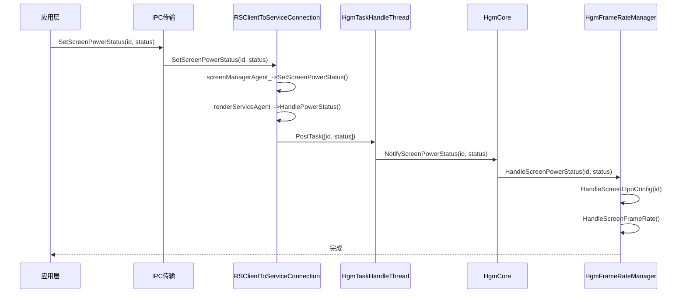
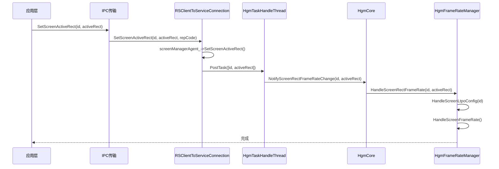
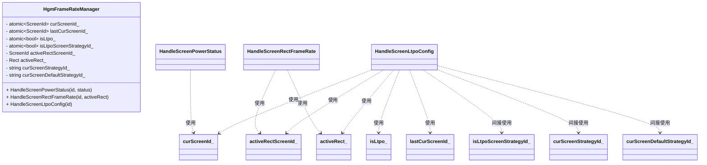

# HgmFrameRateManager 类函数分析

## IPC 调用时序图

### SetScreenPowerStatus 调用时序图



### SetScreenActiveRect 调用时序图



## HandleScreenPowerStatus, HandleScreenRectFrameRate, HandleScreenLtpoConfig 逻辑分析

### 函数逻辑分析

**HandleScreenPowerStatus** (hgm_frame_rate_manager.cpp:922)
- 处理屏幕电源状态变化
- 当屏幕开启且不是当前屏幕时，触发屏幕事件和页面URL事件
- 使用成员变量：`curScreenId_`

**HandleScreenRectFrameRate** (hgm_frame_rate_manager.cpp:950)
- 处理屏幕活动区域帧率
- 更新活动区域ID和矩形信息
- 触发屏幕事件
- 使用成员变量：`activeRectScreenId_`, `activeRect_`

**HandleScreenLtpoConfig** (hgm_frame_rate_manager.cpp:966)
- 处理屏幕切换事件
- 更新当前当前ID、LTPO状态
- 构建屏幕名称（包含活动区域信息）
- 调用屏幕帧率处理
- 使用成员变量：`isLtpo_`, `lastCurScreenId_`, `curScreenId_`, `activeRectScreenId_`, `activeRect_`

### 类图



### 调用关系

```
HandleScreenPowerStatus (屏幕电源状态变化)
    └─> HandleScreenLtpoConfig (屏幕事件处理)
            └─> HandleScreenFrameRate (屏幕帧率处理)

HandleScreenRectFrameRate (活动区域帧率变化)
    └─> HandleScreenLtpoConfig (屏幕事件处理)
            └─> HandleScreenFrameRate (屏幕帧率处理)
```

### 核心逻辑

三个函数协同工作，`HandleScreenLtpoConfig`是核心处理函数，被其他两个函数调用，负责更新屏幕状态并触发帧率策略更新。

### 涉及的成员变量

| 成员变量 | 类型 | 说明 |
|---------|------|------|
| curScreenId_ | atomic<ScreenId> | 当前屏幕ID |
| lastCurScreenId_ | atomic<ScreenId> | 上一个当前屏幕ID |
| isLtpo_ | atomic<bool> | 是否为LTPO屏幕 |
| isLtpoScreenStrategyId_ | atomic<bool> | 当前屏幕策略ID是否包含LTPO |
| activeRectScreenId_ | ScreenId | 活动区域屏幕ID |
| activeRect_ | Rect | 活动区域矩形 |
| curScreenStrategyId_ | string | 当前屏幕策略ID |
| curScreenDefaultStrategyId_ | string | 当前屏幕默认策略ID |
